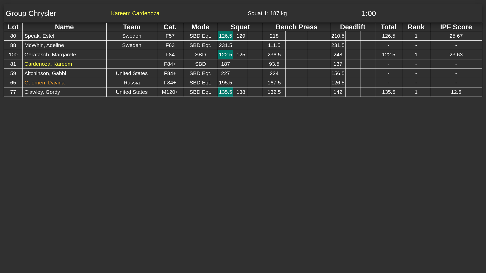
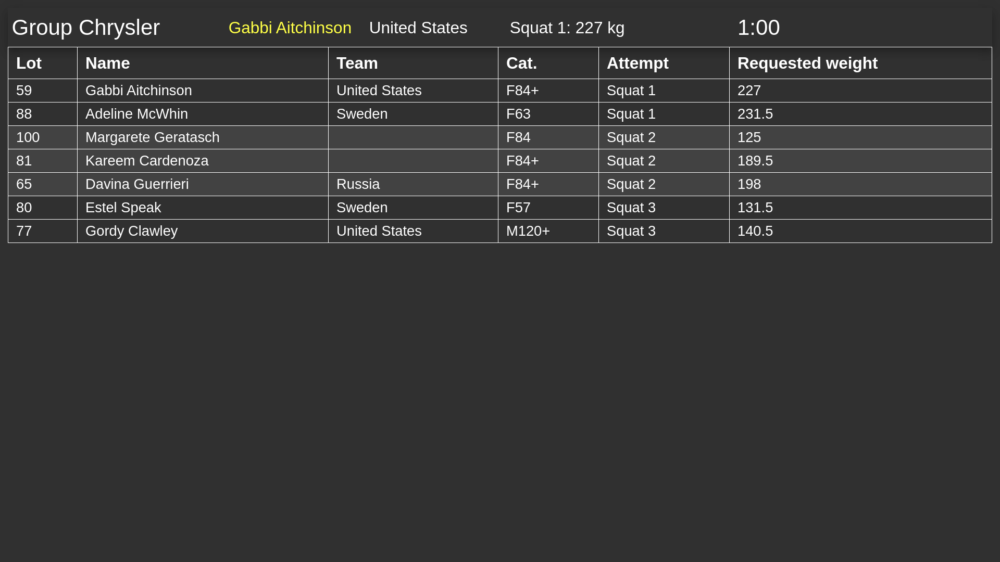
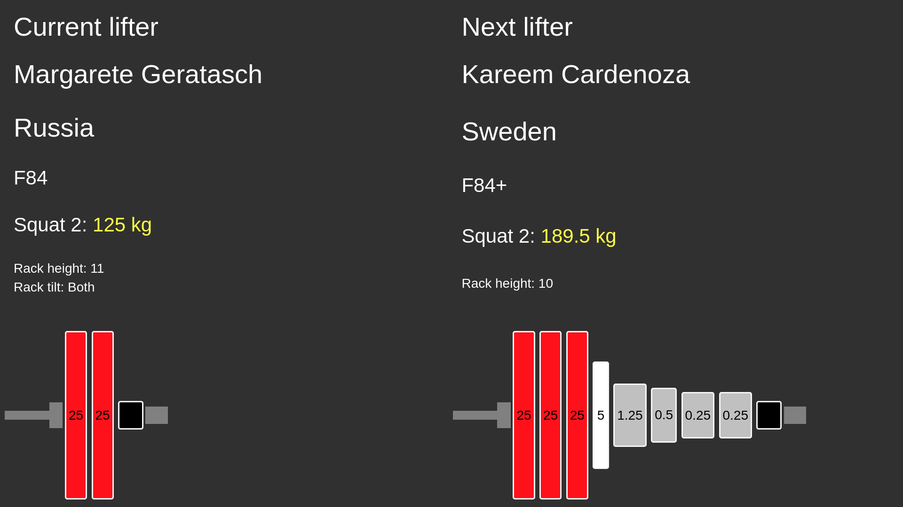
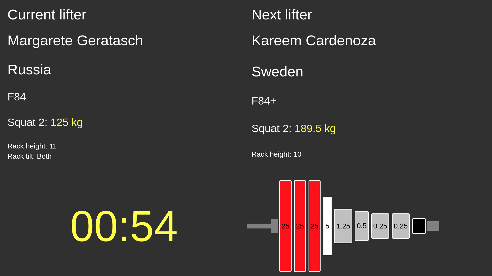
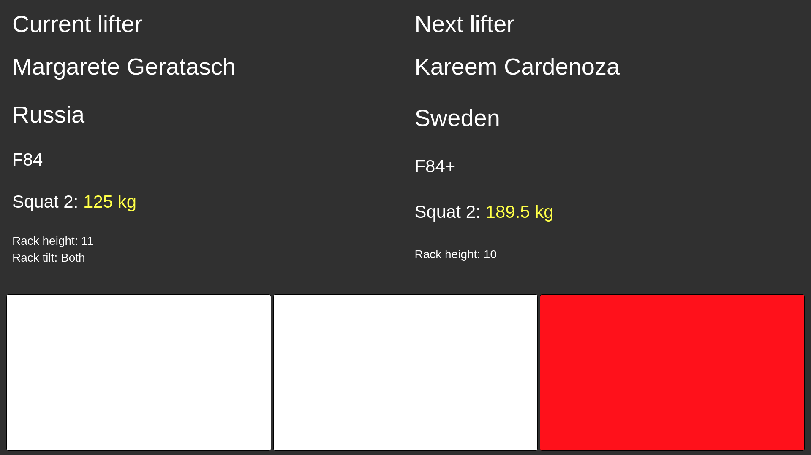

## Main result

Shows the results for the current group with all attempts, total, ranking and score.

## Lift order

Show the the lifting order for the current group. Only displays what the next attemp for each lifter is. Lifters are grouped with color by the attempt number.

## Attempt board

Shows 2 columns; current and next lifter. Lifter and attempt information is displayed aswell as the bar loading.

The bar loading for the current lifter is hidden when the timer isn't at 60 seconds.

The attempt board will also display judge decisions by temporarily hiding the plate loading for both the current and next lifter.

**Note**: This screen also works as a judge decision input, please read [Refereeing - Input](refereeing#input) for more information.
