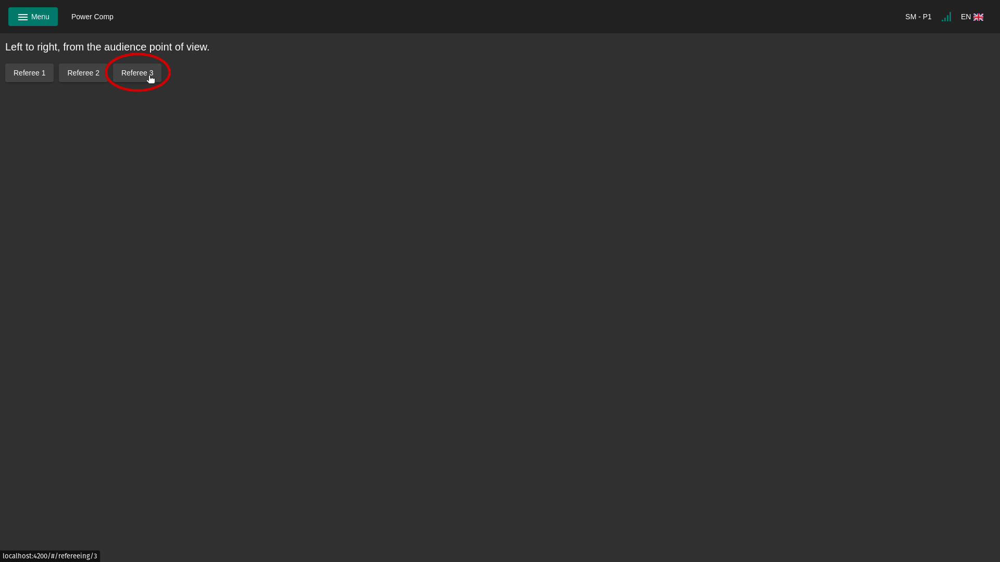
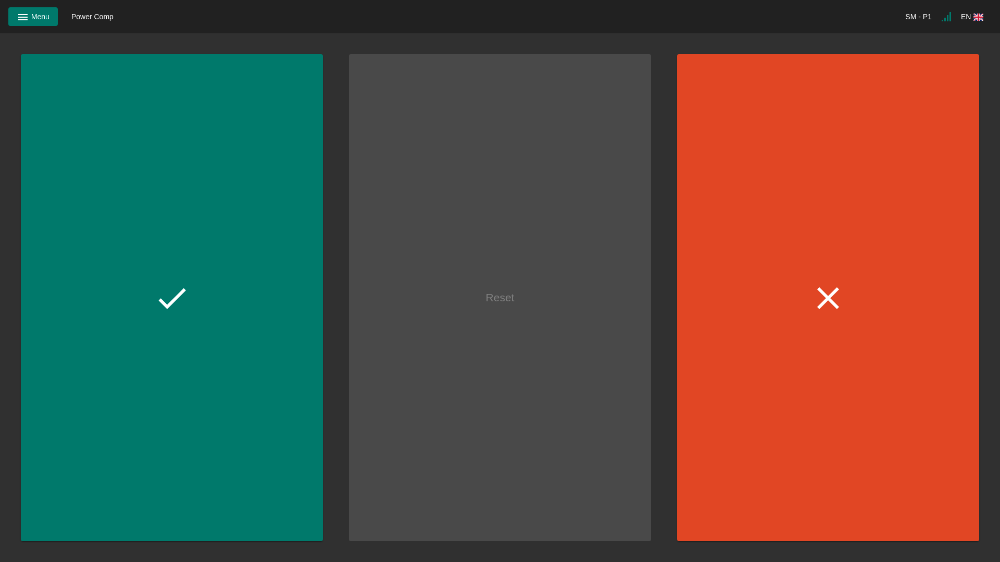

## Mobile

You can select which referee you want to be.

There are 3 buttons:

- **Good lift**
- **Reset:** if a decision is pressed by mistake
- **No lift**
  

## Input

The [attempt board](displays?id=attempt-board) "listens" to keyboard presses and sends the decision to the server. This is however blocked when not logged in and authentication is required (password is set on server).
Any input device can be used for decisions that comply with the following:

- The device is a [HID keyboard](https://en.wikipedia.org/wiki/USB_human_interface_device_class).
- It sends its information as keyboard presses ([ASCII characters](http://www.asciitable.com/)).

This makes it possible to create controllers on you own, e.g. with an [Arduino](https://www.arduino.cc/) and their [HID library](https://www.arduino.cc/reference/en/libraries/keyboard/).

The judge numbers are from left to right, from the audience point of view.

| Judge no. | Good lift key | No lift key |
| --------- | ------------- | ----------- |
| 1         | 1             | 2           |
| 2         | 3             | 4           |
| 3         | 5             | 6           |
